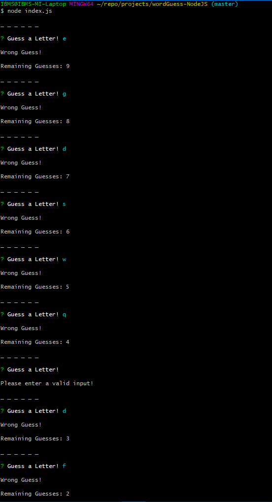

# WordGuess Using NodeJS

## Overview
This application is a Word Guessing game using NodeJS with Command Line Interface (CLI) and constructor functions.

## Project Dependencies:
This app requires this node package: `inquirer`.

## Basic Usage:
* The app runs by navigating into the directory of the app folder, and then type the command  `node index.js` in the command line terminal. As both `word` and `letter` are constructor files.

* The app lets the user to guess 10 wrong letters times and then asks to restart or end the game.

## Screenshots:
Here's some shots playing with the game:

