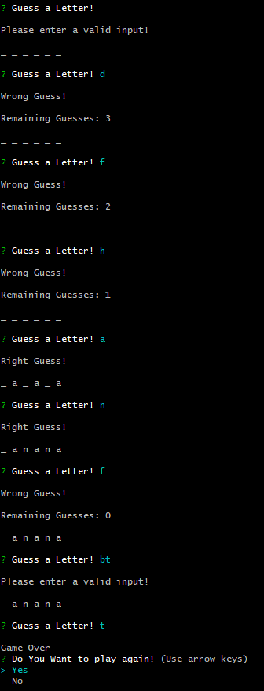
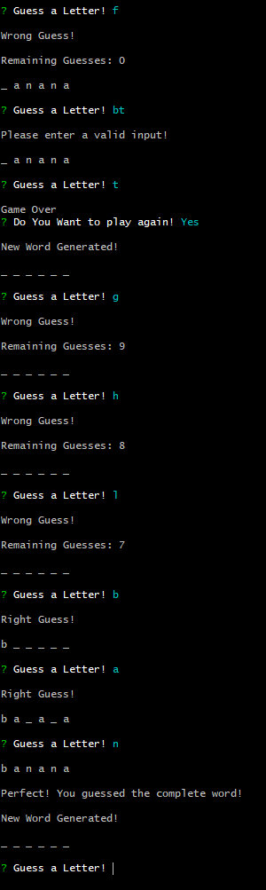

# WordGuess Using NodeJS

### Overview

In this assignment Word Guess command-line game using constructor functions.

### Usage of the Script
*This assignment uses `inquirer` library as it must to have three seperate files (`word`, `letter` and `index`). both `word` and `letter` file are constructors

The app lets the user to guess letter for 10 times as it'll prompt the user to continue of end the game these tries had consumed.

Here's an example for the application in the figures below:

